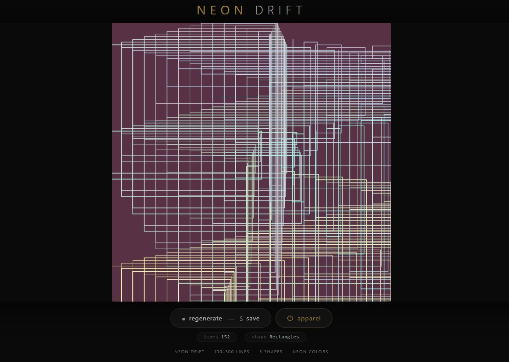
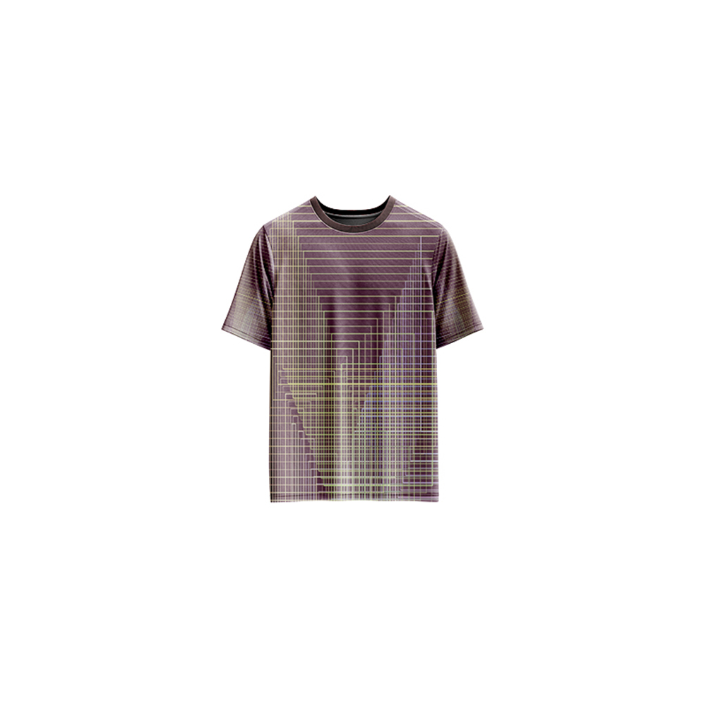

# Neon-Drift-Generative-Art

[](https://reyrove.github.io/Neon-Drift-Generative-Art)
[](https://opensource.org/licenses/MIT)

> **Generative neon art with drifting lines, shapes, and vibrant colors.** Each refresh creates a unique composition of 100–300 glowing elements that drift across the canvas, resembling neon lights in motion.

## 🎨 Live Demo

<div align="center">
  <a href="https://reyrove.github.io/Neon-Drift-Generative-Art" target="_blank">
    
  </a>
  <br><br>
  <a href="https://reyrove.github.io/Neon-Drift-Generative-Art" target="_blank">
    
  </a>
  <br>
  <em>Click the image or button to experience the generative art</em>
</div>

## 👕 Apparel Preview

<div align="center">
  
  <br>
  <em>Neon Drift artwork printed on a T-shirt</em>
</div>

## ✨ Features

- **100–300 Elements** — Each composition features a random number of glowing elements
- **3 Shape Modes** — Lines, Ellipses, or Rectangles
- **Neon Colors** — Vibrant RGB colors in the 150–255 range
- **Drift Motion** — Each element subtly shifts position across the canvas
- **Color Gradients** — Smooth transitions between neon hues
- **Random Background** — Unique contrasting background color
- **Save & Share** — Download as PNG
- **Apparel Mode** — Preview artwork on a T-shirt mockup
- **Responsive** — Works on desktop, tablet, and mobile
- **Pure p5.js** — Built with the creative coding library
- **Keyboard Shortcuts**:
  - `R` — Regenerate
  - `S` — Save image
  - `T` — Toggle apparel view

## 🎨 Artwork Details

| Parameter | Range | Description |
|-----------|-------|-------------|
| **Number of Elements** | 100–300 | Total elements in composition |
| **Shapes** | 3 options | Lines, Ellipses, Rectangles |
| **Color Range** | 150–255 | Neon RGB values |
| **Background** | 0–255 | Random contrasting color |
| **Stroke Weight** | Variable | Based on canvas size |
| **Drift Speed** | Random | Subtle movement per element |

## 🎯 Shape Modes

| Mode | Description |
|------|-------------|
| **0 — Lines** | Classic drifting lines with neon glow |
| **1 — Ellipses** | Organic circular shapes in motion |
| **2 — Rectangles** | Geometric blocks with neon color |

## 🚀 Quick Start

### Local Development

```bash
# Clone the repository
git clone https://github.com/reyrove/Neon-Drift-Generative-Art.git

# Navigate to the directory
cd Neon-Drift-Generative-Art

# Open in browser
open index.html
# or use a live server
```

### Deploy to GitHub Pages

1. Push to GitHub
2. Go to Settings → Pages
3. Select branch `main` and root folder
4. Your site will be live at `https://reyrove.github.io/Neon-Drift-Generative-Art`

## 🧠 How It Works

The artwork is generated using p5.js with a deterministic approach. Every refresh:

1. **Setup**:
   - Random canvas size (responsive to container)
   - Random background color
   - Random number of elements (100–300)
   - Random shape mode (0–2)
   - Random starting positions and deltas

2. **Generation**:
   - Start with random endpoint positions
   - Each element has a slight drift velocity
   - Colors smoothly transition through neon spectrum
   - Elements bounce off canvas edges

3. **Rendering**:
   - Each element drawn with neon-colored stroke
   - Stroke weight varies for depth effect
   - Elements positioned based on drift calculations
   - Creates a glowing, dynamic feel

## 📁 File Structure

```
Neon-Drift-Generative-Art/
├── index.html          # Main application (all-in-one)
├── Neon-Drift.jpg      # T-shirt mockup image
├── fav.svg             # Favicon
├── demo-screenshot.jpg # Website demo screenshot
├── README.md           # This file
└── LICENSE             # MIT License
```

## 🛠️ Tech Stack

- **p5.js** — Creative coding library
- **Canvas API** — 2D rendering
- **CSS Flexbox/Grid** — Responsive layout
- **GitHub Pages** — Hosting

## 🎯 Interactive Controls

| Action | Keyboard | Button |
|--------|----------|--------|
| Regenerate | `R` | Click "regenerate" |
| Save Image | `S` | Click "regenerate" |
| Toggle Apparel | `T` | Click "apparel" |

## 🎨 The Creative Process

### Neon Color Palette
Each composition uses vibrant RGB colors in the 150–255 range, creating a true neon aesthetic. Colors smoothly transition between elements for a gradient effect.

### Drift Motion
Every element in the composition has a unique drift velocity, causing it to slowly move across the canvas. This creates a sense of motion and energy, as if the neon lights are alive.

### Shape Variety
With three distinct shape modes (lines, ellipses, rectangles), each refresh can produce dramatically different visual styles while maintaining the neon drift theme.

### Random Background
A randomly generated dark or light background provides contrast, making the neon colors pop and creating a different mood with each refresh.

## 📱 Responsive Design

The application automatically adapts to:
- Desktop screens
- Tablets
- Mobile phones
- Landscape orientation
- Various aspect ratios
- Small screens (down to 380px wide)

## 🤝 Contributing

Contributions are welcome! Feel free to:
- Fork the repository
- Create a feature branch
- Submit a pull request

### Ideas for Contributions:
- New shape modes
- Additional color palettes
- Animation features
- Interactive controls
- Performance optimizations
- More apparel mockups

## 📄 License

MIT License — see [LICENSE](LICENSE) file for details.

## 🙏 Acknowledgments

- Created with p5.js
- Inspired by neon art and motion graphics
- Special thanks to the creative coding community

---

**Built with 💜 and neon dreams**